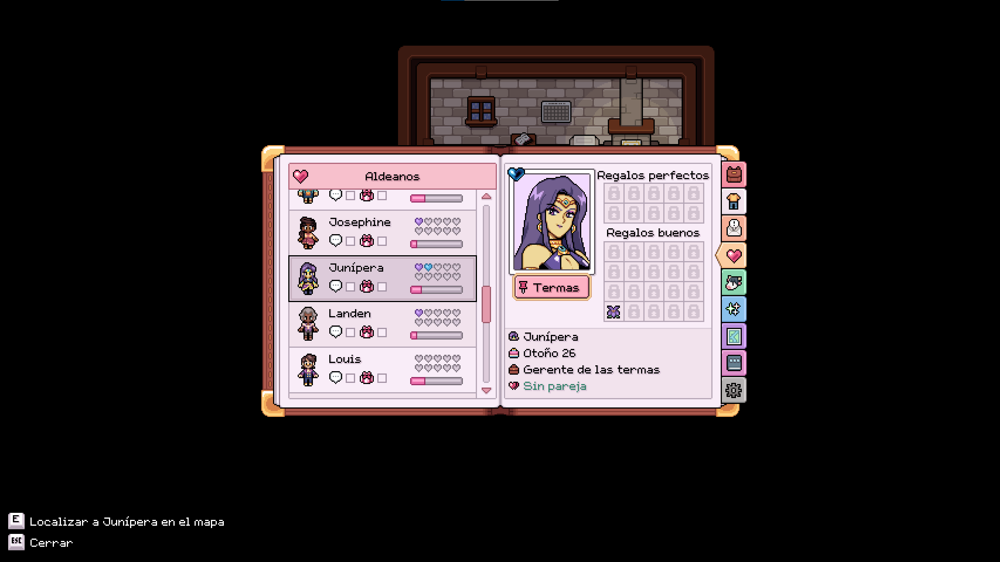
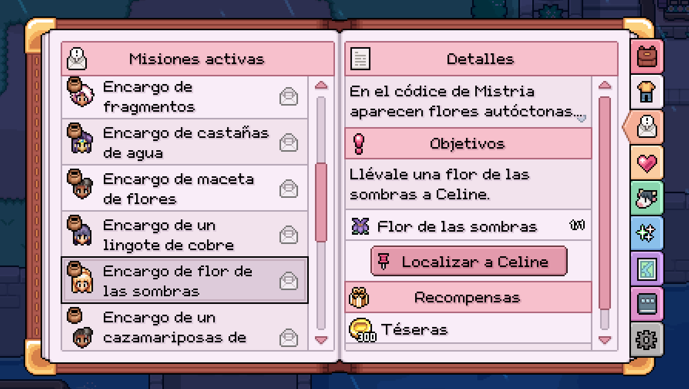

# Find My Mistrian

> Find villagers without memorizing their schedules.

**Find My Mistrian** is a bilingual quality-of-life mod for **Fields of Mistria 1.0.x**. It shows the live location of a character you have already met and can open the correct map region while briefly highlighting that character's existing map icon.

[English](#english) · [Español](#español)



*Compact location control in Relationships / Control compacto de ubicación en Relaciones.*



*The locator also appears for actionable NPC quest objectives / El localizador también aparece en objetivos ejecutables de Misiones que apuntan a un NPC.*

---

## English

### Features

- Shows a compact, clickable **location button beneath the portrait** on the Relationships page.
- Adds a **Locate NPC** button to an active quest when its current, actionable objective targets a known character.
- Opens the correct map region from either Relationships or Quests.
- Pulses the character's vanilla map icon for a few seconds so it is easy to spot.
- Adds an optional `F6` shortcut to open Relationships quickly.
- Supports mouse, keyboard, and controller navigation.
- Includes English and Spanish interface text.
- Uses live game state—the same location data used by the vanilla map—instead of bundled or predicted schedules.
- Does not alter saves, schedules, relationships, inventory, NPC positions, or progression.

### Requirements

- [Fields of Mistria](https://www.fieldsofmistria.com/) 1.0.x
- [Mods of Mistria Installer (MOMI/MMAPI)](https://github.com/Garethp/Mods-of-Mistria-Installer) 0.14.1 or newer

The mod was developed for Fields of Mistria 1.0.2 and validated with MOMI 0.15.1.

### Installation

1. Install MOMI and follow its setup instructions for Fields of Mistria.
2. Download this repository with **Code → Download ZIP**, then extract it.
3. Copy only the extracted [`find_my_mistrian`](find_my_mistrian) folder into the game's `mods` directory.
4. Confirm that the resulting layout is:

   ```text
   Fields of Mistria/
   ├── FieldsOfMistria.exe
   ├── mods/
   │   └── find_my_mistrian/
   │       ├── manifest.json
   │       ├── gml/
   │       ├── fiddle/
   │       └── localization/
   ```

5. Run MOMI, select **Find My Mistrian**, and install/apply the mod.
6. Start Fields of Mistria normally through Steam.

Do not copy the repository's outer `Find-My-Mistrian` folder into `mods`. MOMI must find `manifest.json` directly inside `mods/find_my_mistrian/`.

### How to use

1. Load a save.
2. Press `F6`, or open **Journal → Relationships**.
3. Select a character you have met.
4. Their current location appears as a compact pin button beneath the portrait.
5. Select the location button. The appropriate map opens and the character's icon pulses for approximately four seconds.

For quests, open **Journal → Quests** and select an active quest. A compact **Locate _name_** button appears beneath the current objectives when the active objective has an actionable NPC conversation or delivery target. Collection-only and location/cutscene objectives do not show a button.

Characters you have not met remain hidden according to the game's normal progression rules. If the game has no usable live position or does not currently draw that character's icon, the mod reports that the character cannot be located.

### Configuration

The configuration file is created after the mod first needs it:

```text
%LOCALAPPDATA%\FieldsOfMistria\mod_data\find_my_mistrian\find_my_mistrian.json
```

Default configuration:

```json
{
  "__config_version": 1,
  "enabled": true,
  "highlight_duration": 4,
  "open_map_after_locating": true,
  "hotkey": "F6",
  "debug_logging": false
}
```

| Option | Description |
| --- | --- |
| `enabled` | Enables or disables the mod without uninstalling it. |
| `highlight_duration` | Icon pulse duration, from 1 to 10 seconds. |
| `open_map_after_locating` | Opens the map automatically after selecting the locate button. |
| `hotkey` | A single MMAPI key name, such as `F6` or `HOME`. |
| `debug_logging` | Writes useful diagnostic events to the mod log when set to `true`. |

Close the game before editing the configuration file.

### Troubleshooting

**The mod does not appear in MOMI**

Check for an accidentally nested folder. This is correct:

```text
mods/find_my_mistrian/manifest.json
```

This is incorrect:

```text
mods/Find-My-Mistrian/find_my_mistrian/manifest.json
```

**The location does not appear**

- Confirm that the character has been met and is unlocked in the current save.
- Reapply the mod with MOMI after updating the game or installer.
- Check that both required hooks, `ui.menu_opened` and `ui.menu_closed`, are available.

**The map opens but no icon pulses**

The vanilla game does not draw every NPC icon in every state or subroom. The location readout may still be correct even when no reusable map icon is available.

**I need a diagnostic log**

Set `debug_logging` to `true`, reproduce the problem, and inspect:

```text
%LOCALAPPDATA%\FieldsOfMistria\mod_data\find_my_mistrian\logs\find_my_mistrian.log
```

### Compatibility

The mod decorates the vanilla Relationships, Quests, and Map menus through MMAPI hooks rather than replacing their constructors. Mods that completely replace those menu internals may still conflict.

MOMI 0.15.1 hotkeys are keyboard-only. Controller users can focus the location button by moving right from the Relationships list and can navigate quest locator buttons normally, but the `F6` shortcut requires a keyboard.

### Uninstallation

1. Remove `mods/find_my_mistrian`.
2. Run MOMI again and reapply your remaining mods.
3. Optionally remove the configuration and logs from:

   ```text
   %LOCALAPPDATA%\FieldsOfMistria\mod_data\find_my_mistrian
   ```

The mod does not modify save data, so no save cleanup is required.

### Technical notes

The location readout uses `NPCS[npc_id].location_position`, which is also consumed by the vanilla map. Spoiler protection uses the game's persistent `NPCS[npc_id].has_met()` state, set by vanilla after a valid first conversation—not heart level or mere presence in Relationships.

Quest targets come from `QUEST_LOG.active[quest].quest.tasks[current_stage].query_targets`. Only structured `QuestQueryType.Npc` targets whose vanilla requirements currently pass are eligible; the mod never parses localized objective text and never assumes that `npc_for_icon` is the current target. The map highlight reuses the character's existing small NPC icon and temporarily changes only its alpha; the original value is restored when the timer expires or the map closes.

Automated validation against Fields of Mistria 1.0.2 completed successfully with strict linting, compile checks, and seam checks using MOMI 0.15.1.

---

## Español

### Características

- Muestra un **botón compacto de ubicación bajo el retrato** en la página de Relaciones.
- Añade un botón **Localizar NPC** a una misión activa cuando su objetivo actual y ejecutable apunta a un personaje conocido.
- Abre la región correcta del mapa desde Relaciones o Misiones.
- Hace parpadear durante unos segundos el icono original del personaje para encontrarlo fácilmente.
- Añade el atajo opcional `F6` para abrir Relaciones rápidamente.
- Admite navegación con ratón, teclado y mando.
- Incluye textos de interfaz en inglés y español.
- Utiliza el estado actual del juego —los mismos datos de ubicación que emplea el mapa original— en vez de horarios incluidos o estimados.
- No modifica partidas, horarios, relaciones, inventario, posiciones de NPC ni progreso.

### Requisitos

- [Fields of Mistria](https://www.fieldsofmistria.com/) 1.0.x
- [Mods of Mistria Installer (MOMI/MMAPI)](https://github.com/Garethp/Mods-of-Mistria-Installer) 0.14.1 o posterior

El mod fue desarrollado para Fields of Mistria 1.0.2 y validado con MOMI 0.15.1.

### Instalación

1. Instala MOMI y sigue sus instrucciones de configuración para Fields of Mistria.
2. Descarga este repositorio mediante **Code → Download ZIP** y descomprímelo.
3. Copia únicamente la carpeta extraída [`find_my_mistrian`](find_my_mistrian) dentro de la carpeta `mods` del juego.
4. Comprueba que la estructura resultante sea:

   ```text
   Fields of Mistria/
   ├── FieldsOfMistria.exe
   ├── mods/
   │   └── find_my_mistrian/
   │       ├── manifest.json
   │       ├── gml/
   │       ├── fiddle/
   │       └── localization/
   ```

5. Ejecuta MOMI, selecciona **Find My Mistrian** e instala/aplica el mod.
6. Inicia Fields of Mistria normalmente desde Steam.

No copies la carpeta exterior `Find-My-Mistrian` del repositorio dentro de `mods`. MOMI debe encontrar `manifest.json` directamente en `mods/find_my_mistrian/`.

### Cómo utilizarlo

1. Carga una partida.
2. Pulsa `F6` o abre **Diario → Relaciones**.
3. Selecciona un personaje que ya hayas conocido.
4. Su ubicación actual aparecerá como un botón compacto con pin bajo el retrato.
5. Selecciona el botón de ubicación. Se abrirá el mapa correspondiente y el icono del personaje parpadeará durante unos cuatro segundos.

Para las misiones, abre **Diario → Misiones** y selecciona una misión activa. Aparecerá un botón compacto **Localizar a _nombre_** debajo de los objetivos actuales cuando el objetivo activo tenga una conversación o entrega ejecutable con un NPC. Los objetivos que solo requieren recolectar objetos o acudir a una ubicación/cutscene no muestran el botón.

Los personajes que aún no conoces permanecen ocultos conforme a las reglas normales de progreso. Si el juego no dispone de una posición válida en ese momento o no dibuja el icono del personaje, el mod indicará que no puede localizarlo.

### Configuración

El archivo de configuración se crea cuando el mod lo necesita por primera vez:

```text
%LOCALAPPDATA%\FieldsOfMistria\mod_data\find_my_mistrian\find_my_mistrian.json
```

Configuración predeterminada:

```json
{
  "__config_version": 1,
  "enabled": true,
  "highlight_duration": 4,
  "open_map_after_locating": true,
  "hotkey": "F6",
  "debug_logging": false
}
```

| Opción | Descripción |
| --- | --- |
| `enabled` | Activa o desactiva el mod sin desinstalarlo. |
| `highlight_duration` | Duración del parpadeo del icono, entre 1 y 10 segundos. |
| `open_map_after_locating` | Abre el mapa automáticamente al seleccionar el botón de localización. |
| `hotkey` | Nombre de una sola tecla de MMAPI, como `F6` o `HOME`. |
| `debug_logging` | Registra eventos de diagnóstico útiles cuando su valor es `true`. |

Cierra el juego antes de editar el archivo de configuración.

### Solución de problemas

**El mod no aparece en MOMI**

Comprueba que no haya una carpeta adicional. Esta ruta es correcta:

```text
mods/find_my_mistrian/manifest.json
```

Esta ruta es incorrecta:

```text
mods/Find-My-Mistrian/find_my_mistrian/manifest.json
```

**No aparece la ubicación**

- Confirma que ya conoces al personaje y que está desbloqueado en la partida actual.
- Vuelve a aplicar el mod con MOMI después de actualizar el juego o el instalador.
- Comprueba que estén disponibles los hooks `ui.menu_opened` y `ui.menu_closed`.

**El mapa se abre, pero el icono no parpadea**

El juego original no dibuja todos los iconos de NPC en todos los estados o habitaciones. La ubicación mostrada puede seguir siendo correcta aunque no haya un icono reutilizable en el mapa.

**Necesito un registro de diagnóstico**

Cambia `debug_logging` a `true`, reproduce el problema y revisa:

```text
%LOCALAPPDATA%\FieldsOfMistria\mod_data\find_my_mistrian\logs\find_my_mistrian.log
```

### Compatibilidad

El mod decora los menús originales de Relaciones, Misiones y Mapa mediante hooks de MMAPI, sin reemplazar sus constructores. Aun así, puede entrar en conflicto con mods que sustituyan por completo el funcionamiento interno de esos menús.

Los atajos de MOMI 0.15.1 solo admiten teclado. Con mando se puede enfocar el botón de ubicación moviéndose a la derecha desde la lista de Relaciones y navegar normalmente por los localizadores de Misiones, pero el atajo `F6` requiere un teclado.

### Desinstalación

1. Elimina `mods/find_my_mistrian`.
2. Ejecuta MOMI de nuevo y vuelve a aplicar los demás mods.
3. Opcionalmente, elimina la configuración y los registros de:

   ```text
   %LOCALAPPDATA%\FieldsOfMistria\mod_data\find_my_mistrian
   ```

El mod no modifica las partidas guardadas, por lo que no es necesario limpiarlas.

### Notas técnicas

La ubicación utiliza `NPCS[npc_id].location_position`, el mismo estado que consulta el mapa original. La protección contra spoilers usa el estado persistente `NPCS[npc_id].has_met()`, que vanilla activa después de una primera conversación válida; no usa los corazones ni la mera presencia en Relaciones.

Los objetivos de misión proceden de `QUEST_LOG.active[quest].quest.tasks[current_stage].query_targets`. Solo se admiten objetivos estructurados `QuestQueryType.Npc` cuyos requisitos vanilla ya se cumplen; el mod nunca analiza el texto traducido del objetivo ni presupone que `npc_for_icon` sea el personaje actual. El resaltado reutiliza el icono pequeño existente del personaje y solo modifica temporalmente su opacidad; el valor original se restaura al terminar el tiempo o cerrar el mapa.

La validación automatizada contra Fields of Mistria 1.0.2 terminó correctamente con linting estricto, comprobación de compilación y verificación de puntos de inserción mediante MOMI 0.15.1.

---

## Project layout / Estructura del proyecto

```text
find_my_mistrian/   Installable mod / Mod instalable
RESEARCH.md         Compatibility research / Investigación de compatibilidad
```

Bug reports should include the game version, MOMI version, other installed mods, reproduction steps, and the diagnostic log when available.

Los informes de errores deben incluir la versión del juego, la versión de MOMI, los demás mods instalados, los pasos para reproducir el problema y el registro de diagnóstico cuando esté disponible.
